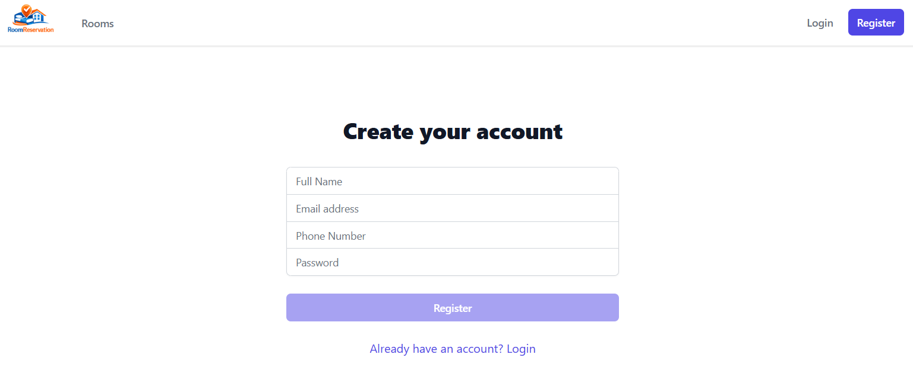
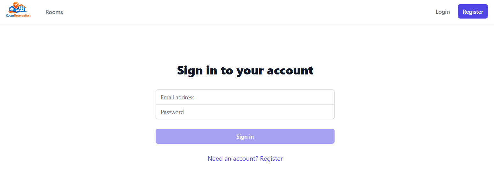
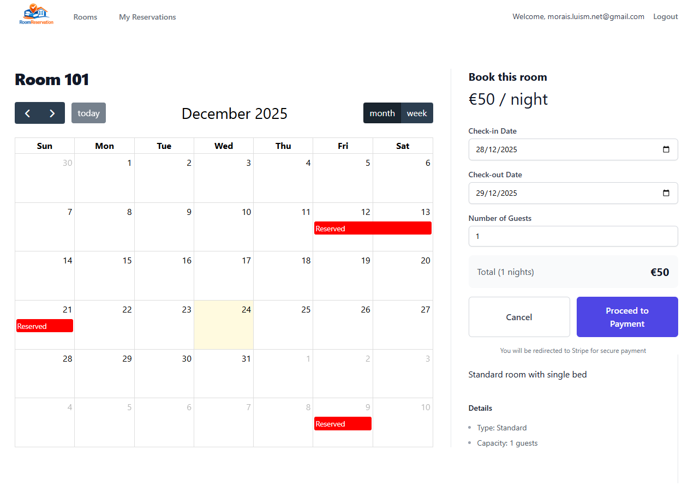
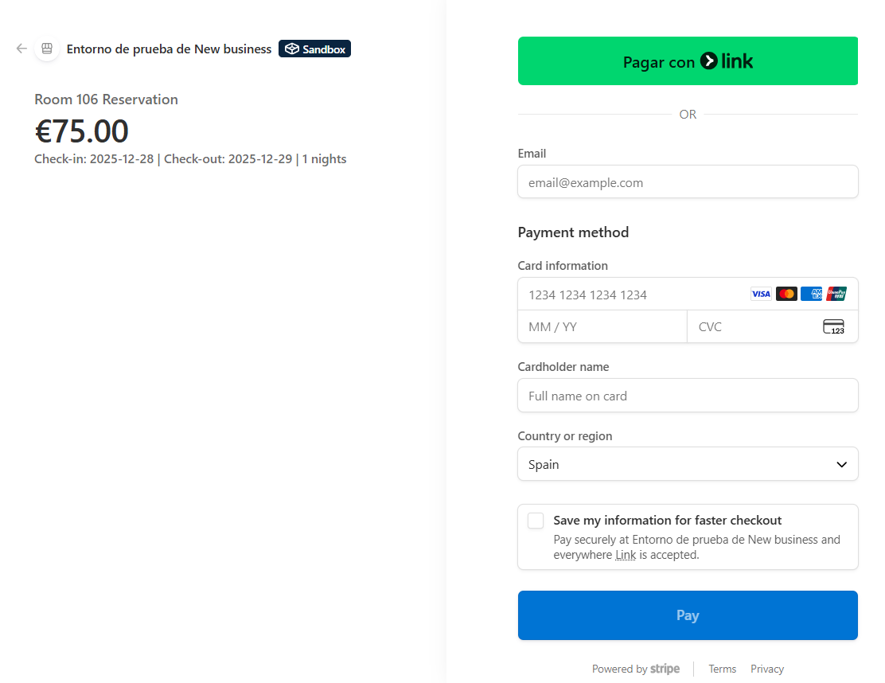
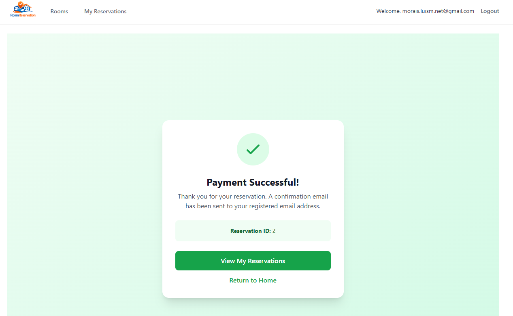
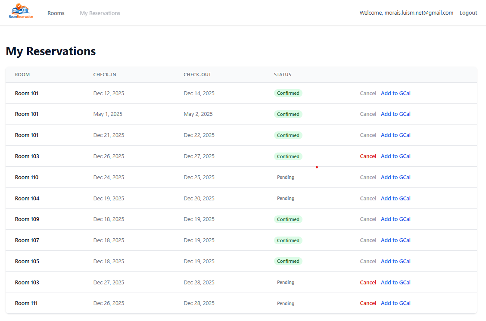
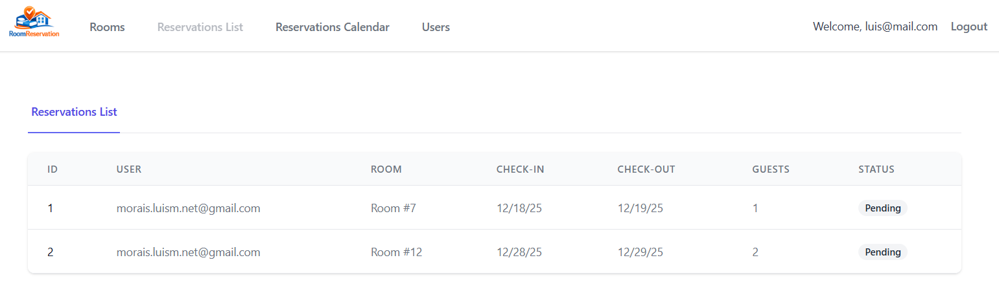
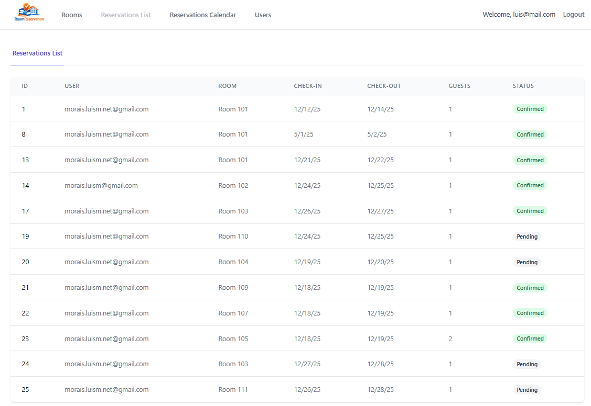
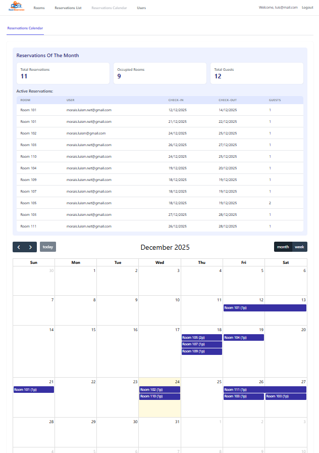
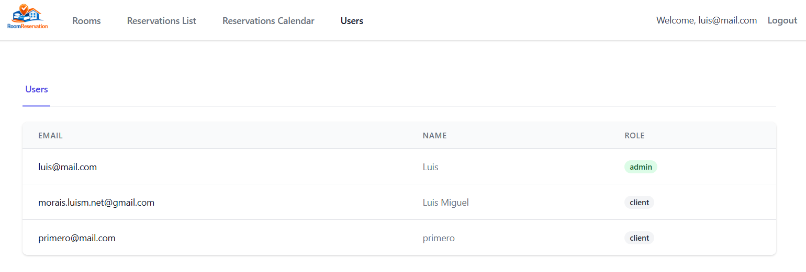

# RoomReservationAngular

RoomReservationAngular is a web application developed with Angular that allows users to manage room reservations. The application is designed to facilitate the booking, viewing, and management of rooms, as well as the administration of users and reservations.

## Features

- **User Authentication**: User registration and login.

- **Room Management**: Creation, viewing, and details of available rooms.

- **Reservations**: Viewing and managing personal and other users' reservations (for administrators).

- **Reservation Calendar**: Viewing reservations in an interactive calendar.

- **Administration Panel**: User and reservation management for administrators.

## Technologies Used

- **Frontend**: Angular 20.3.0
- **Styles**: Tailwind CSS
- **State Management**: RxJS
- **Calendar**: FullCalendar
- **Language**: TypeScript

<kbd>
  
</kbd>
<kbd>
  
</kbd>
<kbd>
  
</kbd>
<kbd>
  
</kbd>
<kbd>
  
</kbd>
<kbd>
  
</kbd>
<kbd>
  
</kbd>
<kbd>
  
</kbd>
<kbd>
  
</kbd>
<kbd>
  
</kbd>
<kbd>
  
</kbd>
<kbd>
  
</kbd>
<kbd>
  
</kbd>

RoomReservationAngular/  
├─── app/  
│   ├─── core/  
│   │   └─── interceptors/  
│   │       └───  auth.interceptor.ts  
│   ├─── environments/  
│   │   └─── environment.ts  
│   ├─── features/  
│   │   ├─── auth/  
│   │   │   ├─── login/   
│   │   │   │    └─── login.component.ts  
│   │   │   ├─── register/  
│   │   │   │   └─── register.component.ts  
│   │   ├─── management/  
│   │   │   ├─── management-navbar/   
│   │   │   │    └─── management-navbar.component.ts  
│   │   │   ├─── reservations-calendar/   
│   │   │   │    └─── reservations-calendar.component.ts  
│   │   │   ├─── reservations-list/   
│   │   │   │    └─── reservations-list.component.ts  
│   │   │   └─── users/   
│   │   │        └─── users.component.ts  
│   │   ├─── payment/  
│   │   │   ├─── payment-cancel/   
│   │   │   │     └─── payment-cancel.component.ts  
│   │   │   └─── payment-success/   
│   │   │        └─── payment-success.component.ts  
│   │   ├─── reservations/  
│   │   │   └─── my-reservations/   
│   │   │        └─── my-reservations.component.ts  
│   │   └─── rooms/    
│   │       ├─── confirmation-modal/   
│   │       │     └─── confirmation-modal.component.ts    
│   │       ├─── room-create/   
│   │       │      └─── room-create.component.ts    
│   │       ├─── room-detail/   
│   │       │     └─── room-detail.component.ts    
│   │       └─── room-list/   
│   │            └─── room-list.component.ts    
│   ├─── guards/    
│   │   └─── admin.guard.ts    
│   ├─── layout/   
│   │   ├─── navbar/    
│   │   │        └─── navbar.component.ts   
│   │   └─── shared/    
│   │            └─── footer.component.ts  
│   ├─── models/  
│   │    ├─── auth.model.ts  
│   │    ├─── reservation.model.ts  
│   │    ├─── room.model.ts  
│   │    ├─── room-type.model.ts  
│   │    └─── user.model.ts  
│   ├─── services/    
│   │    ├─── admin.service.ts  
│   │    ├─── auth.service.ts  
│   │    ├─── payment.service.ts  
│   │    ├─── reservation.service.ts  
│   │    ├─── room.service.ts  
│   │    └─── room-type.service.ts  
│   ├─── app.config.ts  
│   ├─── app.routes.ts  
│   ├─── app.ts  
└─── main.ts  
angular.json  
package.json

## Requirements

- Node.js (version 18 or higher)
- npm (version 9 or higher) or yarn
- Angular CLI (version 20.3.13 or higher)

## Installation

1. Clone the repository:

``bash
git clone https://github.com/moraisLuismNet/RoomReservationAngular.git

``

2. Navigate to the project directory:

``bash
cd RoomReservationAngular

``

3. Install dependencies:

``bash
npm install

``

4. Start the application:

``bash
npm start

``

This will start the application in development mode. Open your browser and navigate to `http://localhost:4200` to see the application in action.

## Configuration

The application uses an environment file (`environment.ts`) to configure variables such as the backend API URL. Be sure to configure this file according to your needs.

## Project Structure

- `src/app/auth`: Authentication components (login, registration).

- `src/app/features`: Main application components (room management, bookings, users).

- `src/app/services`: Services for communication with the backend API.

- `src/app/models`: Data models used in the application.

- `src/app/guards`: Route guards to protect specific routes.

## Stripe Integration

The application includes Stripe integration for handling payments. The following components have been added:

### Payment Service

The `PaymentService` has been updated to handle Stripe checkout sessions and payment confirmations. It includes methods for:

- Creating a Stripe checkout session for a reservation.
- Handling payment success and cancellation redirects.
- Confirming payments and updating reservation statuses.

### Payment Components

Two new components have been added to manage the payment flow:

- `payment-success.component.ts`: Handles successful payments and displays confirmation messages.
- `payment-cancel.component.ts`: Manages cancelled payments and allows users to retry.

### Configuration

To configure Stripe in the frontend, ensure the following settings are correctly set in the `environment.ts` file:

```typescript
export const environment = {
  production: false,
  apiUrl: 'https://your-api-url.com',
  stripePublishableKey: 'your-stripe-publishable-key',
};
```

### Usage

1. When a user proceeds to payment, the application creates a Stripe checkout session.
2. Upon successful payment, the user is redirected to the success page, and the reservation is confirmed.
3. If the payment is cancelled, the user is redirected to the cancellation page and can retry the payment.

[DeepWiki moraisLuismNet/RoomReservationAngular](https://deepwiki.com/moraisLuismNet/RoomReservationAngular)
